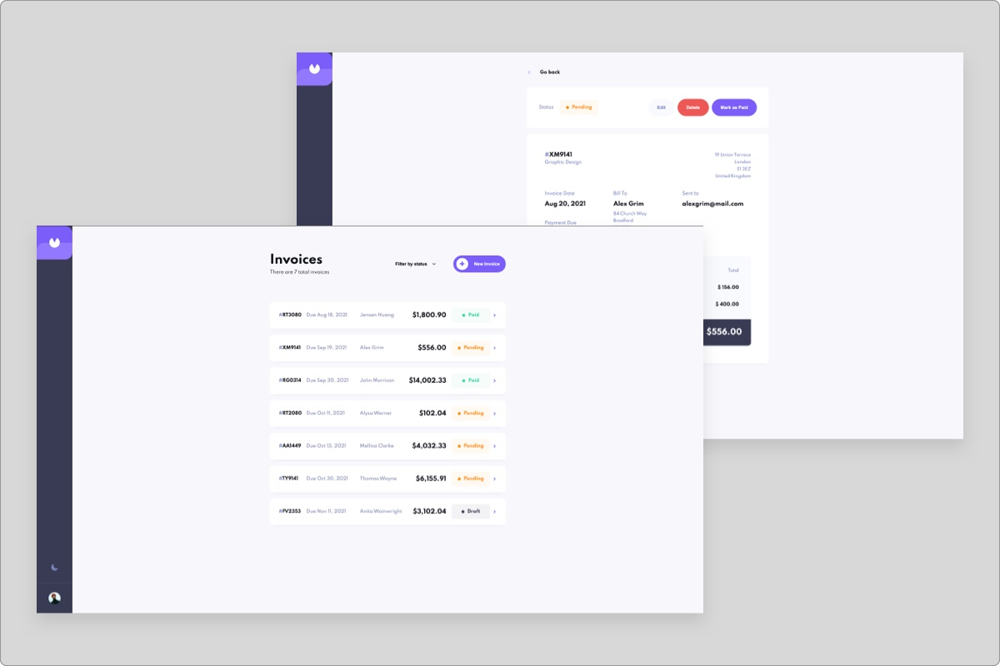

# Invoice app

Hi! This is an invoicing application built with React JS and CSS modules. The application manages invoices and allows user to create, read, update, filter, and delete invoices.

## Table of contents

- [Overview](#overview)
  - [Features](#the-challenge)
  - [Screenshot](#screenshot)
  - [Links](#links)
- [My process](#my-process)
  - [Built with](#built-with)
  - [Continued development](#continued-development)
- [Author](#author)

## Overview

### Features

- View the optimal layout for the app depending on device's screen size
- Hover states for all interactive elements on the page
- Create, read, update, and delete invoices
- Receive form validations when trying to create/edit an invoice
- Save draft invoices, and mark pending invoices as paid
- Filter invoices by status (draft/pending/paid)
- Keep track of any changes, even after refreshing the browser

### Screenshot

### Links

- Live Site URL: [Add live site URL here](https://invoiceapp-rr3.netlify.app/)

## My process

### Built with

- HTML5
- CSS modules
- Flexbox
- CSS Grid
- Mobile-first workflow
- React
- [React Router](https://reactrouter.com)
- [React Icons](https://react-icons.github.io/react-icons/)
- [React DatePicker](https://reactdatepicker.com)

### Continued development

I plan to continue working on adding new features such as adding functionality to the theme toggle switch, adding authorization, and possibly connecting to a database instead of leveraging local storage.

## Author

- Website - [Russell Rice](https://rr3developer.netlify.app/)
